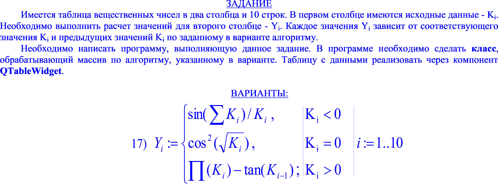
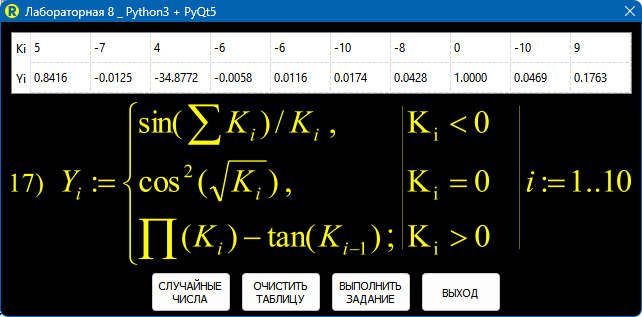
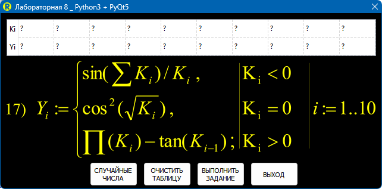

$$\sin \left( \sum_{i=1}^{i=10} K_i \right) \ \ \ \ \ \ \ \ \ \ \ \ \ \ \ \ \ \ \ \ \ \ \ \  K_i < 0$$

$$\cos^2 \left( \sqrt{K_i} \right) \ \ \ \ \ \ \ \ \ \ \ \ \ \ \ \ \ \ \ \ \ \ \ \ \ \ K_i = 0$$

$$\prod \left( K_i \right) - \tan \left( K_{i-1} \right) \ \ \ \ \ \ \ \ \ \ \ K_i > 0$$

Нажми, чтобы посмотреть условие задачи

<picture>
  <source media="(prefers-color-scheme: dark)" srcset="_MY_PICTURES/TASK_8_YELLOW.png">
  <source media="(prefers-color-scheme: light)" srcset="_MY_PICTURES/TASK_8_BLUE.png">
  
</picture>

|
-|-
|
